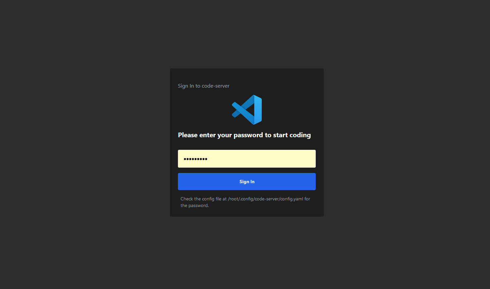

# Dark Mode Login Page for Code-Server

This repository provides a dark mode theme for the login page of [code-server](https://github.com/coder/code-server), along with VS Code logos. The theme enhances the login experience with a sleek, dark interface.

## Preview



## Features
- Dark Mode design
- Integrated VS Code branding for a consistent feel
- Customizable login page text (e.g., app name and welcome message)

## Installation Instructions

Follow the steps below to install the dark mode theme on your code-server instance. Please note that after each code-server update or upgrade, this process will need to be repeated as code-server will overwrite the theme files.

### Step-by-Step Installation

1. **Download the repository archive** and extract it into the root (`/`) directory. This will replace the original template files located in the `code-server` installation folder.

   ```bash
   # Download the theme
   wget https://github.com/sickplanet/code-server-dark-mode-login-page/archive/refs/heads/main.zip

   # Extract the archive into the root directory
   sudo unzip main.zip -d /

   # Remove the downloaded zip file
   rm main.zip
2. **Add or modify the following lines in `config.yaml`**:
   
   ```yaml
   app-name: VS Code (server)
   welcome-text: Please enter your password to start coding
   
2.1 **Example commands to modify `config.yaml`**:

   For a regular user:

   ```bash
   nano /home/USER/.config/code-server/config.yaml
   ```
   For root:

   ```bash
   sudo nano /root/.config/code-server/config.yaml
   ```
   **Notes:**
       -The app-name and welcome-text configurations allow you to personalize the login page with your own branding or a custom welcome message.
       -Ensure you restart code-server after making changes to the config.yaml for them to take effect.
    
3.**Restarting Code-Server**

   After applying the dark mode theme and making any customizations (e.g., modifying the `config.yaml` to add custom `app-name` and `welcome-text`), you need to restart code-server for the changes to take effect.
   
   ###Restart code-server with the following command:
   
   ```bash
   sudo systemctl restart code-server
   ```
   **Notes:**
       -This step is essential to apply any changes, including the theme or text customizations.
       -You will need to perform this step after reinstalling the theme if code-server is updated or upgraded, as the update will restore the default theme files.
   
   **Contributing**
   Feel free to submit pull requests or open issues for feature requests, bug reports, or enhancements.
